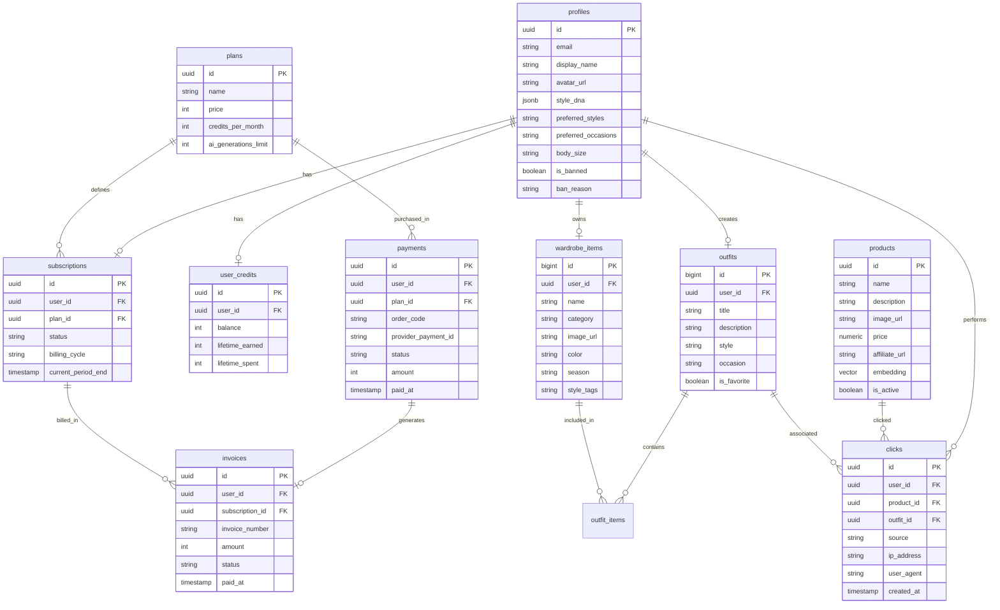

# 📄 Tài liệu Phát triển & Vận hành MVP — Redo TuaTua AI

Chào mừng bạn đến với tài liệu hướng dẫn kỹ thuật cho phiên bản **MVP (Minimum Viable Product)** của dự án **Redo TuaTua AI** — Trợ lý Stylist Thời trang AI cá nhân dành cho thị trường Việt Nam.

---

## 📌 1. Tổng quan MVP

**Redo TuaTua AI** giải quyết bài toán thời trang thường ngày: giúp người dùng quản lý tủ đồ cá nhân, gợi ý phối đồ thông minh theo dịp (cafe, đi làm, hẹn hò...) từ những món đồ sẵn có, đồng thời đề xuất mua sắm các sản phẩm thời trang thịnh hành thông qua liên kết affiliate với các sàn TMĐT.

Thay vì kiến trúc Monorepo Microservices cồng kềnh được định nghĩa trong tài liệu thiết kế ban đầu, phiên bản **MVP thực tế** đã được triển khai hoàn chỉnh dưới dạng **Serverless Architecture** sử dụng **Supabase** làm backend chính. Điều này giúp tối ưu hóa chi phí vận hành, giảm độ trễ giao tiếp mạng và tăng tốc độ phát triển sản phẩm.

### Trạng thái MVP hiện tại:
- **Frontend**: Đã hoàn thiện giao diện người dùng (landing page, wardrobe, recommender, trends, profile, admin area) và kết nối API thật.
- **Backend & DB**: Supabase PostgreSQL tích hợp Row Level Security (RLS) và Database Functions/Triggers bảo mật.
- **AI & Integrations**: Các tính năng AI được credit-gated bằng Deno Edge Functions, tích hợp thanh toán tự động qua cổng **PayOS** và hệ thống hóa đơn email tự động qua **Resend**.

---

## 🏗️ 2. Kiến trúc Hệ thống MVP

Kiến trúc thực tế của Redo TuaTua AI MVP được tinh gọn hóa thông qua mô hình Serverless:

```
┌──────────────────────────────────────────────────────────────────┐
│                         CLIENT LAYER                             │
│       React 18 + Vite + TypeScript (Deployed on Vercel)          │
└────────────────────────────────┬─────────────────────────────────┘
                                 │ HTTPS (Queries / Mutations)
                                 ▼
┌──────────────────────────────────────────────────────────────────┐
│                      SUPABASE BACKEND LAYER                      │
│                                                                  │
│  ┌───────────────────────┐  ┌─────────────────────────────────┐  │
│  │     Supabase Auth     │  │       Supabase PostgreSQL       │  │
│  │ (Email, Google OAuth) │  │  (RLS, Triggers, RPC Helpers)   │  │
│  └───────────────────────┘  └─────────────────────────────────┘  │
│                                              ▲                   │
│                                              │ Internal DB calls │
│                                              ▼                   │
│  ┌────────────────────────────────────────────────────────────┐  │
│  │             Supabase Deno Edge Functions                   │  │
│  │  (converse, generate-outfit, analyze-upload, etc.)         │  │
│  └──────────────────────────────┬─────────────────────────────┘  │
└─────────────────────────────────┼────────────────────────────────┘
                                  │ External APIs
                                  ▼
      ┌───────────────────────────┴───────────────────────────┐
      │                  EXTERNAL INTEGRATIONS                │
      │   ┌───────────────────┐           ┌───────────────┐   │
      │   │    PayOS API      │           │  Resend API   │   │
      │   │ (Payment Gateway) │           │ (Email & PDF) │   │
      │   └───────────────────┘           └───────────────┘   │
      └───────────────────────────────────────────────────────┘
```

### Chi tiết Công nghệ sử dụng:
1. **Frontend**:
   - **React 18** + **TypeScript** + **Vite** (Build Tool).
   - **Tailwind CSS** + **shadcn/ui** (Thiết kế phong cách editorial & premium).
   - **TanStack React Query** (Quản lý trạng thái server-state, cache và optimistic updates).
   - **Framer Motion** (Xử lý các chuyển động mượt mà, micro-animations).
2. **Backend (Supabase)**:
   - **Supabase Auth**: Hỗ trợ đăng nhập email/password truyền thống và Google OAuth.
   - **PostgreSQL Database**: Quản lý dữ liệu quan hệ với cơ chế Row Level Security (RLS) để cô lập dữ liệu người dùng.
   - **Deno Edge Functions**: Các API xử lý logic nghiệp vụ nặng, kết nối AI và tích hợp bên thứ ba.
3. **Cổng thanh toán & Dịch vụ ngoài**:
   - **PayOS**: Cổng thanh toán trực tuyến của Việt Nam hỗ trợ chuyển khoản QR code nhanh (VietQR).
   - **Resend**: Gửi email tự động.
   - **pdf-lib**: Sinh file hóa đơn dạng PDF đính kèm trong email.

---

## 🔒 3. Cơ chế Bảo mật & Phân quyền (Auth & RBAC)

Hệ thống phân quyền trong MVP được thiết kế để bảo mật tuyệt đối dữ liệu người dùng và tách biệt khu vực quản trị:

### 3.1 Luồng Đăng nhập & Xác thực
- Hỗ trợ đăng ký và đăng nhập bằng email thường hoặc **Google OAuth** (với cơ chế tự động liên kết tài khoản bảo mật `security_manual_linking_enabled = true` được cấu hình thông qua SQL).
- Sau khi xác thực thành công, route `/auth/callback` sẽ bắt và kiểm tra profile của user:
  - Nếu tài khoản có cờ `is_banned = true`, hệ thống lập tức gọi `signOut()` và hiển thị màn hình thông báo bị khóa cùng lý do khóa.
  - Gọi RPC `is_admin_user` để xác định role (`admin` hoặc `user`) trước khi lưu trạng thái vào `AuthContext`.
  - Nếu là Admin, điều hướng trực tiếp đến trang `/admin`.

### 3.2 Phân quyền Admin (RBAC)
- Sử dụng cấu trúc vai trò dựa trên bảng `admin_roles` (ví dụ: `super_admin`, `editor`, `moderator`) và bảng phân quyền chi tiết `admin_permissions` trên 10 module hệ thống (`dashboard`, `users`, `ai_engine`, `products`, `trends`, `plans`, `analytics`, `notifications`, `reports`, `settings`).
- Mọi trang CRUD trong khu vực Admin đều sử dụng route guard và kiểm tra quyền cụ thể của tài khoản trước khi render UI hoặc cho phép thay đổi dữ liệu.
- Sử dụng cơ chế `dialog discriminated union state` cho tất cả các trang quản trị để loại bỏ hiện tượng dual overlays (hiển thị đè các popup hội thoại) và tận dụng nút tắt mặc định của `DialogContent`.

---

## 🧬 4. Hệ thống Tủ đồ & Phối đồ AI (AI Outfit & Credit Gating)

Tính năng AI Stylist là giá trị cốt lõi của ứng dụng và được kiểm soát chi phí chặt chẽ bằng cơ chế Gating.

### 4.1 Cơ chế kiểm soát lượt dùng AI (Credit Gating Middleware)
Mọi Deno Edge Function liên quan đến trí tuệ nhân tạo (converse, generate outfit, analyze upload...) đều được bọc bởi middleware `withCreditCheck` (`supabase/functions/_shared/credits.ts`):

1. **Kiểm tra số dư (Credit Balance)**:
   - Hệ thống truy vấn bảng `user_credits` để lấy số dư `balance` hiện tại của user.
   - Hệ thống kiểm tra gói subscription của user qua bảng `subscriptions` và `plans`.
   - Nếu gói của user có giới hạn (limit !== 0) và số dư `balance <= 0`, API sẽ trả về lỗi `CreditError` yêu cầu người dùng nâng cấp gói.
2. **Khởi tạo Job**:
   - Ghi nhận một bản ghi trạng thái `processing` vào bảng `ai_jobs`.
3. **Thực thi AI & Trừ Credits**:
   - Nếu tác vụ AI thành công:
     - Cập nhật trạng thái job thành `completed`.
     - Nếu gói của user không phải là "Vô hạn" (limit !== 0), hệ thống sẽ trừ **1 credit** trong bảng `user_credits` và tăng `lifetime_spent`.
     - Ghi nhận lịch sử giao dịch vào bảng `credit_transactions` (amount = -1, type = 'generation').
     - Lưu nhật ký hiệu năng vào bảng `ai_generation_logs` (thời gian xử lý, model sử dụng, trạng thái success).
   - Nếu tác vụ AI thất bại:
     - Cập nhật trạng thái job thành `failed` kèm theo lỗi chi tiết.
     - Lưu log thất bại vào bảng `ai_generation_logs` và trả lỗi về client.

### 4.2 Các Edge Functions AI hoạt động:
- `analyze-upload`: Phân tích ảnh món đồ tải lên để tự động gắn nhãn (danh mục, màu sắc, phong cách, mùa).
- `generate-outfit`: Sinh bộ phối đồ hoàn chỉnh dựa trên các item có sẵn trong tủ đồ và dịp lựa chọn.
- `converse`: Chatbot stylist tư vấn phong cách trực tiếp, gợi ý outfit cụ thể.
- `analyze-wardrobe`: Phân tích tổng quan tủ đồ hiện tại để tìm ra "khoảng trống phong cách" (gap analysis).
- `style-recommendations`: Đưa ra danh sách gợi ý thời trang cá nhân hóa hàng ngày.

---

## 💳 5. Quy trình Thanh toán & Hóa đơn tự động

Hệ thống thanh toán MVP tích hợp với **PayOS** và dịch vụ hóa đơn **Resend**. Do một số hạn chế về việc đăng ký webhook của tài khoản merchant thử nghiệm, hệ thống hỗ trợ cả cơ chế webhook động và cơ chế fallback chủ động:

```
                  [ Khởi tạo Thanh toán ]
                            │
                            ▼
           Tạo link qua /create-payment Edge Function
         (Lưu payment trạng thái "pending", orderCode tự sinh)
                            │
                            ▼
               Người dùng thực hiện thanh toán QR
                            │
            ┌───────────────┴───────────────┐
            │ (Luồng Webhook chính)         │ (Luồng Fallback Client)
            ▼                               ▼
       PayOS gọi tới                PaymentResultPage gọi tới
       /payos-webhook               /verify-payment Edge Function
            │                               │
            ├───────────────────────────────┘
            ▼
    [ Xử lý Kết quả ]
    1. Kiểm tra chữ ký bảo mật HMAC-SHA256
    2. Sử dụng PG Advisory Lock để đảm bảo Idempotency (Không xử lý trùng)
    3. Cập nhật bảng `payments` trạng thái "completed" & điền "paid_at"
    4. Kích hoạt/Cập nhật gói tại bảng `subscriptions` (Thời hạn +1 tháng/năm)
    5. Cộng credit tương ứng của gói vào bảng `user_credits`
    6. Ghi nhận `credit_transactions` & `billing_events`
    7. Tạo hóa đơn trong bảng `invoices` dạng "paid"
    8. Gọi hàm `sendInvoiceEmail` (Tạo PDF hóa đơn + Gửi qua Resend API)
```

### 5.1 Đảm bảo tính nhất quán và chống trùng lặp (Idempotency)
- Sử dụng trường `idempotency_key` (được sinh từ `paymentLinkId` hoặc `orderCode` kết hợp với trạng thái sự kiện) trong bảng `payments_log`.
- Khi webhook hoặc API fallback được kích hoạt, hệ thống sẽ thực hiện truy vấn kiểm tra sự tồn tại của key này trước khi thực hiện cộng credit/kích hoạt gói. Nếu đã tồn tại, lập tức bỏ qua và trả về thành công để tránh việc cộng trùng credit cho người dùng.

### 5.2 Xử lý hoàn tiền (Refunds)
- Khi nhận được sự kiện `provider_event = 'refund'` từ webhook PayOS, hệ thống tự động:
  - Cập nhật trạng thái payment thành `refunded` và ghi nhận số tiền hoàn.
  - Khấu trừ lại lượng credit tương ứng trong bảng `user_credits` của user (nhưng giới hạn tối thiểu là 0 để tránh số âm).
  - Cập nhật trạng thái subscription thành `cancelled`.
  - Lưu transaction hoàn tiền tương ứng để đối soát.

### 5.3 Tự động Đối soát Thanh toán (Deno Cron & Admin API)
Để xử lý trường hợp mất kết nối webhook hoặc thanh toán chưa được đồng bộ kịp thời, ứng dụng tích hợp tiến trình đối soát tự động:
- **Đối soát định kỳ (Deno Cron)**: Hàm `cron-reconcile-payments` đăng ký chạy mỗi 5 phút một lần (`Deno.cron`). Nó quét tối qua 50 bản ghi thanh toán có trạng thái `pending` hoặc `processing` được tạo trong 24 giờ qua.
- **Truy vấn trạng thái trực tiếp**: Thực hiện gọi trực tiếp API của PayOS qua endpoint `https://api-merchant.payos.vn/v2/payment-requests/{orderCode}` để kiểm tra trạng thái thanh toán. Nếu trạng thái giao dịch là `PAID`, hệ thống sẽ kích hoạt nâng cấp gói cước tương tự như webhook. Nếu giao dịch không tồn tại trên hệ thống của PayOS (lỗi 404), giao dịch sẽ được cập nhật thành `expired`.
- **Kích hoạt thủ công cho Admin**: Cung cấp một HTTP endpoint trong hàm đối soát này, bảo vệ bằng RPC `is_admin_user`, cho phép quản trị viên kích hoạt luồng đối soát bất cứ lúc nào thông qua giao diện Admin Dashboard.

---

## 🛍️ 6. Hệ thống Affiliate & Tìm kiếm Vector (pgvector)

Để xây dựng tính năng gợi ý mua sắm thông minh thông qua affiliate link (Shopee, TikTok Shop...), ứng dụng tích hợp công cụ tìm kiếm ngữ nghĩa theo vector:

### 6.1 Tìm kiếm Tương đồng sản phẩm (Vector Similarity Search)
- **Embedding**: Các sản phẩm trong bảng `products` được phân tích và tạo vector embedding 768 chiều (sử dụng mô hình Gemini `text-embedding-004`).
- **Lưu trữ**: Cột `embedding` sử dụng kiểu dữ liệu `vector(768)` thông qua extension `pgvector` trên PostgreSQL.
- **Indexing**: Tạo index `idx_products_embedding` sử dụng thuật toán **IVFFlat** (`vector_cosine_ops` với `lists = 100`) nhằm tăng tốc độ truy vấn cosine similarity.
- **RPC Search**: Hàm `search_products(query_embedding, match_count)` thực hiện tính toán độ tương đồng cosine (`1 - (p.embedding <=> query_embedding)`) để lọc ra các sản phẩm giống với phong cách, kiểu dáng hoặc màu sắc của tủ đồ người dùng nhất.

### 6.2 Theo dõi Click (Affiliate Click Tracking)
- Mọi lượt click vào link affiliate được ghi nhận vào bảng `clicks` (lưu trữ `user_id`, `product_id`, `outfit_id`, `source`, địa chỉ IP, User Agent).
- Cơ chế bảo mật RLS đảm bảo người dùng chỉ xem được click history của chính mình, trong khi Admin được quyền xem toàn bộ để thống kê phân tích hiệu suất và tính toán hoa hồng.

---

## ⚙️ 7. Danh sách Deno Edge Functions

Dưới đây là bảng tổng hợp các Edge Functions chạy trên Deno đã được triển khai trong ứng dụng:

| Tên Function | Vai trò / Tính năng | Trạng thái | AI Credit-Gated |
|---|---|---|---|
| `converse` | Trò chuyện trực tiếp và tư vấn phong cách với AI Stylist | Đã triển khai | **Có** (1 credit) |
| `generate-outfit` | Tự động sinh phối đồ theo yêu cầu từ tủ đồ có sẵn | Đã triển khai | **Có** (1 credit) |
| `analyze-upload` | Phân tích hình ảnh quần áo tải lên để tự động điền metadata | Đã triển khai | **Có** (1 credit) |
| `analyze-wardrobe` | Phân tích khoảng trống thời trang trong tủ đồ (gap analysis) | Đã triển khai | **Có** (1 credit) |
| `style-recommendations`| Đề xuất thời trang cá nhân hóa hàng ngày cho người dùng | Đã triển khai | **Có** (1 credit) |
| `create-payment` | Tạo link thanh toán VietQR thông qua PayOS API | Đã triển khai | Không |
| `payos-webhook` | Nhận kết quả thanh toán từ PayOS, kích hoạt gói & gửi email hóa đơn | Đã triển khai | Không |
| `verify-payment` | Client gọi trực tiếp để xác minh trạng thái giao dịch (fallback) | Đã triển khai | Không |
| `cron-reconcile-payments`| Chạy tự động mỗi 5 phút hoặc gọi thủ công để đối soát thanh toán | Đã triển khai | Không |
| `build-outfit` | Ghép sản phẩm và item tủ đồ thành outfit hoàn chỉnh | Đã triển khai | Không |
| `create-outfit` | Lưu trữ bộ phối đồ mới vào cơ sở dữ liệu | Đã triển khai | Không |
| `track-click` | API trung gian ghi nhận thông tin nhấp chuột vào affiliate link | Đã triển khai | Không |
| `impact-search` | Gọi tìm kiếm sản phẩm vector tương đồng phục vụ affiliate gợi ý | Đã triển khai | Không |
| `impact-sync` | Đồng bộ hóa danh mục sản phẩm affiliate từ hệ thống đối tác | Đã triển khai | Không |
| `tryon` | Thực hiện gọi API Kling Virtual Try-On để thử đồ ảo lên hình ảnh người dùng | Đang tích hợp (API Draft) | **Có** (2 credits) |

---

## 📊 8. Cấu trúc Cơ sở dữ liệu (Database Schema)

Dưới đây là sơ đồ tóm tắt các bảng quan trọng nhất trong cơ sở dữ liệu Supabase PostgreSQL của Redo TuaTua AI:



### Các bảng bổ sung phục vụ hệ thống log và giám sát:
- `payments_log`: Lưu lịch sử tất cả các webhook payload và API log của PayOS.
- `ai_jobs`: Quản lý các job bất đồng bộ gọi tới AI, phục vụ việc đối soát trạng thái (`processing`, `completed`, `failed`).
- `ai_generation_logs`: Ghi nhận hiệu năng (độ trễ `latency_ms`, model, trạng thái) của các lượt sử dụng AI.
- `credit_transactions`: Nhật ký thay đổi số dư credit của người dùng (mua gói, sử dụng tính năng, hoàn tiền).
- `notification_inbox`: Hộp thư thông báo trong ứng dụng của người dùng.

---

## 🤖 9. Tích hợp AI Thử đồ Ảo (Kling Kolors Virtual Try-On)

Để người dùng có thể "mặc thử" các bộ trang phục hoặc sản phẩm mua sắm lên ảnh cá nhân, MVP tích hợp dịch vụ thử đồ ảo **Kolors Virtual Try-On** cung cấp bởi **Kling AI** (Singapore endpoint).

### 9.1 Quy trình Tích hợp & Luồng Nghiệp vụ (Try-On Flow)
Do tác vụ xử lý hình ảnh qua mô hình Deep Learning của Kling cần thời gian từ 10 - 30 giây để hoàn thành, hệ thống sử dụng cơ chế xử lý bất đồng bộ (Asynchronous Task processing):

1. **Khởi tạo Tác vụ (Create Task)**:
   - Gửi yêu cầu `POST` tới: `https://api-singapore.klingai.com/v1/images/kolors-virtual-try-on`
   - **Headers**:
     - `Content-Type: application/json`
     - `Authorization: Bearer <KLING_API_KEY>`
   - **Body (JSON)**:
     - `model_name`: `"kolors-virtual-try-on-v1-5"` (Khuyên dùng phiên bản 1.5, hỗ trợ phối đơn hoặc kết hợp phối "áo + quần" trên cùng một ảnh nền trắng).
     - `human_image`: Đường dẫn URL ảnh người mẫu hoặc chuỗi Base64 sạch (không chứa tiền tố `data:image/png;base64,`).
     - `cloth_image`: Đường dẫn URL ảnh quần áo hoặc chuỗi Base64 sạch.
     - `callback_url`: Địa chỉ webhook của hệ thống nhận thông báo kết quả (nếu dùng cơ chế Webhook).
     - `external_task_id`: Mã tác vụ tùy chọn do hệ thống tự sinh để đối soát.
   - **Phản hồi từ Kling**: Trả về `task_id` và trạng thái ban đầu (`submitted` hoặc `processing`).

2. **Truy vấn Kết quả (Query Task)**:
   - Client hoặc Edge Function thực hiện `GET` tới: `https://api-singapore.klingai.com/v1/images/kolors-virtual-try-on/{task_id}`
   - **Headers**: Tương tự như trên.
   - **Phản hồi**:
     - Kiểm tra trường `data.task_status`. Các trạng thái bao gồm: `submitted`, `processing`, `succeed`, `failed`.
     - Khi trạng thái là `succeed`, trường `data.task_result.images` sẽ trả về danh mục ảnh kết quả có chứa `url` của ảnh thử đồ hoàn chỉnh.
     - Hệ thống tự động cập nhật URL ảnh này vào trường `try_on_image` trong bảng `outfits` hoặc hiển thị trực tiếp lên giao diện của người dùng.
     - Lưu ý: Ảnh kết quả trên máy chủ Kling sẽ bị xóa sau 30 ngày để đảm bảo bảo mật dữ liệu, do đó hệ thống cần tải ảnh về và lưu trữ trên Supabase Storage của dự án.

3. **Kiểm tra tài nguyên tài khoản (Account costs)**:
   - Để giám sát và cảnh báo lượng tài nguyên Kling còn lại, hệ thống có thể gọi API kiểm tra cost:
     - `GET https://api-singapore.klingai.com/account/costs?start_time={ts_ms}&end_time={ts_ms}` (với QPS <= 1).
     - API này miễn phí gọi và phản hồi danh sách các gói tài nguyên cùng số lượng còn lại (`remaining_quantity`).

### 9.2 Hạn mức & Kiểm soát chi phí (Credit Gating)
- Tác vụ Thử đồ Ảo là tác vụ nặng trên GPU, do đó trong middleware `withCreditCheck`, mỗi lượt sử dụng tính năng Try-on thành công sẽ bị khấu trừ **2 credits** từ tài khoản của người dùng (so với 1 credit đối với các tác vụ văn bản/gợi ý phối đồ thông thường).
- API Key được mã hóa và bảo mật nghiêm ngặt dưới dạng Supabase Secret (`KLING_API_KEY`), không bao giờ lộ dưới Client-side.

---

## 🛠️ 10. Hướng dẫn Cấu hình & Phát triển (Setup Guide)

Để vận hành hệ thống MVP ở môi trường local cũng như production, hãy thực hiện theo các bước sau:

### 9.1 Biến môi trường Frontend (`.env`)
Tạo file `.env` ở thư mục gốc của dự án:
```env
VITE_SUPABASE_URL=https://your-project-ref.supabase.co
VITE_SUPABASE_ANON_KEY=your-supabase-anon-key
VITE_USE_MOCK_API=false
```

### 9.2 Biến môi trường Backend (Supabase Secrets)
Chạy các lệnh sau thông qua Supabase CLI để cấu hình các dịch vụ tích hợp cho Deno Edge Functions:
```bash
# Cấu hình cổng thanh toán PayOS
supabase secrets set PAYOS_CLIENT_ID=your-payos-client-id
supabase secrets set PAYOS_API_KEY=your-payos-api-key
supabase secrets set PAYOS_CHECKSUM_KEY=your-payos-checksum-key

# Cấu hình dịch vụ gửi email Resend
supabase secrets set RESEND_API_KEY=re_your-resend-api-key
```

### 9.3 Hướng dẫn khởi chạy dưới local
1. **Cài đặt các gói thư viện**:
   ```bash
   bun install # hoặc npm install
   ```
2. **Khởi chạy Frontend trong môi trường phát triển**:
   ```bash
   bun run dev
   ```
3. **Khởi chạy Supabase cục bộ (nếu phát triển offline)**:
   ```bash
   supabase start
   ```

### 9.4 Hướng dẫn deploy Edge Functions lên Production
Khi bạn cập nhật các Edge Function trong thư mục `supabase/functions/`, sử dụng lệnh sau để cập nhật trực tiếp lên cloud của Supabase:
```bash
# Triển khai một hàm cụ thể (ví dụ: converse)
supabase functions deploy converse --project-ref your-project-ref

# Triển khai toàn bộ các hàm
supabase functions deploy --project-ref your-project-ref
```

---

## 📈 11. Các bước tiếp theo (Hậu MVP)
1. **Đăng ký Webhook chính thức với PayOS**: Tạo cấu hình cổng thanh toán chính thức trên dashboard của PayOS để chuyển đổi từ cơ chế fallback `verify-payment` sang webhook tự động hoàn toàn.
2. **Tối ưu hóa chi phí AI**: Thử nghiệm các mô hình LLM mã nguồn mở nhỏ gọn hơn (như Llama 3) thế cho các model thương mại lớn để giảm chi phí credit trên từng lượt gợi ý phối đồ.
3. **Tích hợp Affiliate API Sàn**: Đồng bộ tự động danh mục sản phẩm thời trang thịnh hành của Shopee và TikTok Shop thông qua API chính thức để tăng tỷ lệ chuyển đổi hoa hồng.
